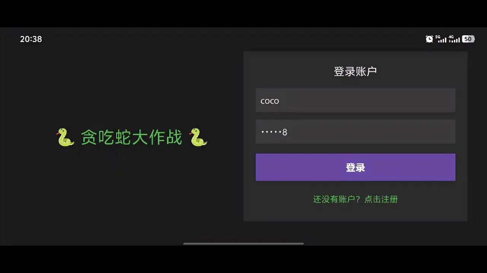
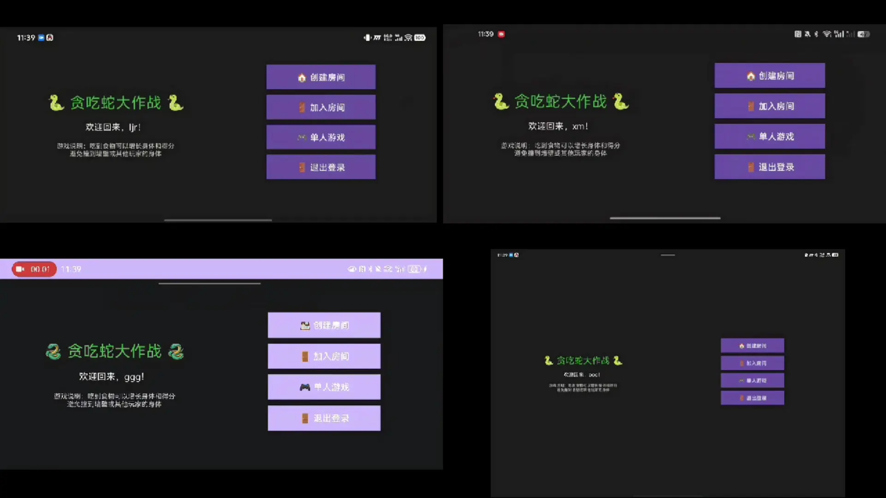
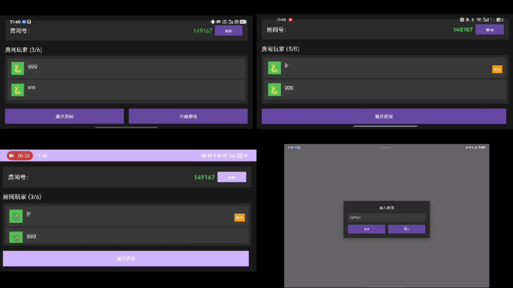
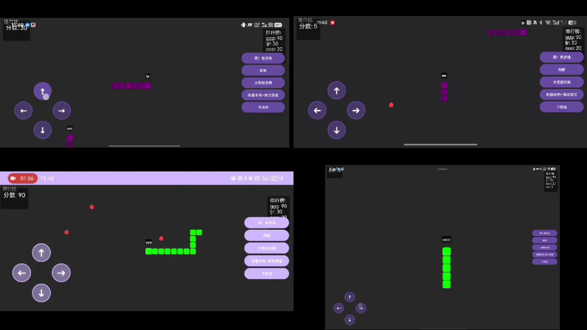
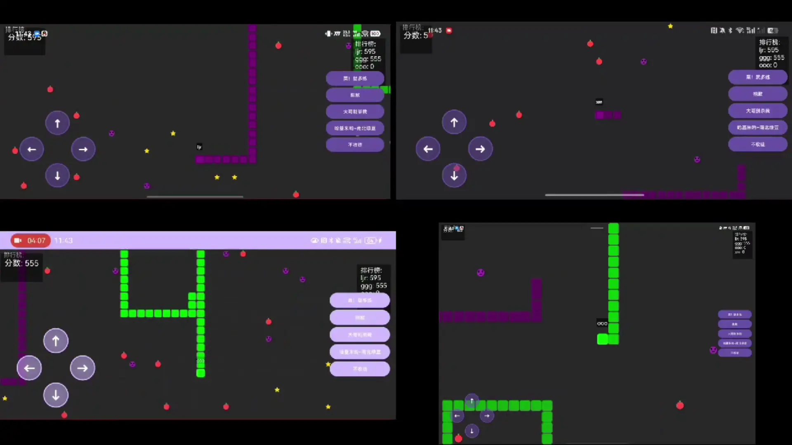

# DDSnake — 基于 DDS 的实时多人贪吃蛇（Android 端）

一款基于 **DDS（Data Distribution Service，数据分发服务）** 实时通信中间件构建的多人在线贪吃蛇游戏客户端。客户端采用 Android + Java 开发，通过 ZR-DDS 中间件与后台实时同步游戏状态，支持多台设备在**同一局域网**下建房、组队与实时对战。

本仓库为项目中的 **Android 移动端**部分，包含客户端源码、DDS 数据类型定义（IDL）以及服务端联调工具。

---

## 目录

- [项目背景](#项目背景)
- [功能特性](#功能特性)
- [总体架构](#总体架构)
- [DDS 通信设计](#dds-通信设计)
- [界面与效果展示](#界面与效果展示)
- [项目结构](#项目结构)
- [快速开始](#快速开始)
- [性能测试](#性能测试)
- [后续规划](#后续规划)
- [致谢](#致谢)

---

## 项目背景

本项目为暑期校企实践课程作品（实训周期 2025.08.25 – 2025.09.19）。课程要求必须使用 **南京臻融科技有限公司** 提供的 **ZR-DDS** 数据分发服务中间件，实现一套**基于 DDS 的实时贪吃蛇游戏系统**。

我们围绕 DDS「发布 / 订阅（Publisher/Subscriber）」通信模型设计了完整的实时游戏系统：

- 使用 **IDL（Interface Definition Language）** 定义游戏消息类型，由 DDS 工具链自动生成 Java 代码与 `DataWriter` / `DataReader` 接口，避免手写底层网络通信；
- 后台（Java + MySQL）负责账号认证、房间管理、游戏逻辑结算；
- **Android 端（本仓库）** 负责界面呈现、玩家操作采集，并通过 DDS 与后台及房间内其他玩家实时同步；
- 通过 **DDS 域（Domain）与 Topic 的 QoS 策略** 实现房间隔离与数据可靠性分级。

实训期间，本组成员完成了需求分析、IDL 消息设计、后台业务开发、Android 客户端开发、联调与性能测试的全流程。本人负责其中的 **Android 移动端开发**，包括：客户端 UI 与游戏渲染、DDS 发布/订阅的封装与线程管理、登录注册与房间流程对接、实时对局状态呈现等。

---

## 功能特性

- **DDS 实时通信**：基于 ZR-DDS 中间件，通过 Topic 发布/订阅完成客户端与后台、客户端之间的实时数据同步。
- **账号系统**：登录 / 注册，认证请求与结果均通过 DDS 消息（`PLAYERAUTH_REQUEST` / `PLAYERAUTH_RESULT`）传递。
- **房间系统**：
  - 创建房间 / 输入 6 位房间号加入房间；
  - 房间号经算法映射为 **DDS 域号（Domain ID）**，实现不同房间的数据域隔离；
  - 房间大厅实时展示玩家列表与人数，支持离开房间、房主开始游戏；
  - 每位玩家在房间内分配唯一颜色用于区分蛇身。
- **大世界对局**：游戏运行在 100×100 的网格大世界地图中，屏幕仅显示以蛇头为中心的视野区域，视野随蛇头移动而滚动。
- **多人在线**：同一房间内多名玩家实时对战，其余玩家的蛇由后台逻辑同步而来。
- **丰富的食物与道具**：苹果（+分+长度）、星星（高收益）、骷髅头（减分减长度）；玩家死亡时蛇身转化为食物掉落。
- **定时积分赛**：每局 5 分钟定时结算，按分数排名，玩家死亡后进入旁观模式，可跟随排行榜第一名的视野。
- **排行榜**：实时展示当前房间各玩家得分排序。
- **实时聊天**：房间内玩家可通过 DDS 发送聊天消息。

---

## 总体架构

系统整体分为「后台」与「Android 客户端」两部分，二者通过 DDS 中间件在局域网内通信。

```
┌─────────────────────────────┐        ┌─────────────────────────────┐
│        Android 客户端        │        │           后台（Java）         │
│                             │        │                             │
│  ┌───────────────────────┐  │        │  ┌───────────────────────┐  │
│  │        UI 层          │  │        │  │    控制器层            │  │
│  │ Activity / GameSurface │  │        │  │  GameController       │  │
│  │ View（渲染、操作）      │  │        │  └──────────┬────────────┘  │
│  └───────────┬───────────┘  │        │             │               │
│              │  MVP         │        │  ┌──────────▼────────────┐  │
│  ┌───────────▼───────────┐  │        │  │       业务层           │  │
│  │      Presenter        │  │        │  │  Auth/Room/Game/      │  │
│  │  GamePresenter        │  │        │  │  Collision/Item       │  │
│  └───────────┬───────────┘  │        │  └──────────┬────────────┘  │
│              │              │        │             │               │
│  ┌───────────▼───────────┐  │        │  ┌──────────▼────────────┐  │
│  │    DDS 通信层          │  │        │  │      DDS 通信层        │  │
│  │  Publisher/Subscriber  │  │        │  │  DdsBridge           │  │
│  │  DDSManager 单例       │  │        │  └──────────┬────────────┘  │
│  └───────────┬───────────┘  │        │             │               │
└──────────────┼──────────────┘        └─────────────┼──────────────┘
               │                                      │
               └──────────────── ZR-DDS 中间件（局域网） ────────────┘
                            （Topic 发布 / 订阅）
```

客户端内部采用 **MVP（Model-View-Presenter）** 分层，并在其上再拆分出一层独立的 **DDS 通信层**，使游戏逻辑与通信细节解耦：

| 分层 | 职责 | 代表类 |
| --- | --- | --- |
| View | 界面渲染与用户操作采集 | `GameSurfaceView`、各 Activity |
| Presenter | 游戏规则逻辑、状态更新 | `GamePresenter` |
| Contract | MVP 层接口契约 | `GameContract` |
| Model | 游戏数据模型 | `GameWorld`、`Snake`、`Player`、`Point`、`Food` |
| DDS 通信层 | 发布/订阅封装、线程管理 | `DDSManager`、各 `*Publisher`、`ThreadManager`、各 `*SubscriberThread` |

**DDS 核心管理**：`DDSManager` 以单例方式持有 `DomainParticipant` / `Publisher` / `Subscriber`，并按 **Domain ID** 缓存多实例，实现不同通信域的隔离复用。App 启动时在 `MyApplication` 中加载 ZR-DDS 原生库、完成 `DomainParticipantFactory` 初始化与基础通信实体创建。

---

## DDS 通信设计

### 数据类型定义（IDL）

游戏内所有消息类型均由 IDL 文件声明（`idl/SnakeGame.idl`、`idl/Supplement.idl`），经 DDS 工具链自动生成 Java 代码（`app/src/main/java/com/example/snakegame/DDSgenerated/`）。

主要消息类型：

| 消息 | 说明 | 方向 |
| --- | --- | --- |
| `PlayerAuth` | 登录/注册认证请求与结果 | 双向 |
| `PlayerMove` | 玩家移动方向输入 | 客户端 → 后台 |
| `GameState` | 玩家蛇的实时位置与分数 | 后台 → 客户端 |
| `PlayerInfo` | 玩家信息（昵称、颜色） | 客户端 → 后台 |
| `InRoom` / `JoinRoom` / `LeaveRoom` | 房间状态、加入/离开房间 | 双向 |
| `StartGame` | 开始游戏指令 | 客户端 → 后台 |
| `Item` / `GetFood` | 食物道具生成与吃食物事件 | 后台 → 客户端 |
| `Collision` | 碰撞事件通知 | 后台 → 客户端 |
| `Leaderboard` | 排行榜数据 | 后台 → 客户端 |
| `ChatMsg` | 聊天消息 | 双向 |
| `SystemMsg` | 系统消息（JOIN/EXIT/START/END） | 双向 |
| `PlayerColorMapping(s)` | 玩家 ID 与蛇颜色映射 | 双向 |

### Topic 与 QoS 策略

不同消息的实时性、可靠性与历史保留需求不同，故结合 DDS 的 **Reliability / Durability / History** 三项 QoS 分别定制：

| Topic | Reliability | Durability | History | 设计意图 |
| --- | --- | --- | --- | --- |
| `PLAYERMOVE` | RELIABLE | VOLATILE | KEEP_LAST(1) | 高频操作，只关心最新方向输入 |
| `GAMESTATE` | RELIABLE | VOLATILE | KEEP_LAST(1) | 高频状态，丢弃旧样本保留最新 |
| `LEADERBOARD` | RELIABLE | TRANSIENT_LOCAL | KEEP_LAST(1) | 需为新加入订阅者提供最新数据 |
| `SYSTEMMSG` | RELIABLE | TRANSIENT_LOCAL | KEEP_LAST(1) | 系统广播，新加入者也应能收到 |
| `ITEM` | RELIABLE | TRANSIENT_LOCAL | KEEP_ALL | 食物道具不可丢失、不可遗漏 |
| `GETFOOD` | RELIABLE | TRANSIENT_LOCAL | KEEP_ALL | 吃食物事件同样不允许丢失 |
| `COLLISION` | RELIABLE | VOLATILE | KEEP_ALL | 碰撞为一次性事件，不能丢 |
| `CHATMSG` | RELIABLE | VOLATILE | KEEP_ALL | 聊天需保证完整送达，无需持久化 |

> 移动指令、游戏状态等高频且「只关心最新值」的数据采用 `VOLATILE + KEEP_LAST(1)` 以降低网络与缓存开销；排行榜、系统消息等需要向后加入者传递快照的数据采用 `TRANSIENT_LOCAL + KEEP_LAST(1)`；食物、吃食物事件等一旦丢失会导致状态不一致的数据采用 `KEEP_ALL` 确保完整送达。

### 房间隔离：房间号 → DDS 域号

每个房间映射到独立的 **DDS Domain**，使不同房间的通信完全隔离互不干扰：

```
6 位房间号 ──► encryptRoomIdToDomain() ──► Domain ID
```

加入房间后，客户端使用该域号创建对应的 `DomainParticipant`，仅在本房间的域内收发消息，天然实现房间级数据隔离。

---

## 界面与效果展示

### 1. 登录 / 注册



动图演示：输入昵称注册 / 登录，认证请求通过 DDS 发送至后台，后台校验后返回结果，成功则进入主页。

### 2. 创建房间 / 加入房间



动图演示：输入 6 位房间号创建房间或加入他人房间，房间号映射为 DDS 域号，加入成功后跳转到房间大厅。

### 3. 房间大厅



动图演示：房间大厅实时展示在线玩家列表与人数（含房主标识），每位玩家分配蛇颜色，房主点击「开始游戏」进入对局，其他玩家同步收到开始指令。

### 4. 实时对局



动图演示：100×100 大世界网格中，多条蛇实时移动与进食，屏幕视野跟随自己的蛇头滚动；其他玩家蛇同步呈现。

### 5. 定时积分赛结算



动图演示：5 分钟定时积分赛结束后显示最终得分与排名；玩家中途死亡后自动进入旁观模式，视野跟随排行榜第一名的蛇。

---

## 项目结构

```
SnakeGame-main/
├── app/                                    # Android 客户端
│   ├── lib/
│   │   ├── jni/                            # ZR-DDS 原生动态库（.so）
│   │   └── ZRDDSd.jar                      # ZR-DDS Java API 封装
│   └── src/main/
│       ├── java/com/example/snakegame/
│       │   ├── DDSgenerated/               # 由 IDL 自动生成的 DDS 类型与读写器
│       │   ├── data/
│       │   │   ├── dds/
│       │   │   │   ├── DDSManager.java     # DDS 核心单例（域参与者/发布者/订阅者）
│       │   │   │   ├── publisher/          # DataWriter 封装（发布方）
│       │   │   │   │   ├── PlayerAuthPublisher   # 认证请求
│       │   │   │   │   ├── JoinRoomPublisher     # 加入房间
│       │   │   │   │   ├── InRoomPublisher       # 房间状态
│       │   │   │   │   ├── LeaveRoomPublisher    # 离开房间
│       │   │   │   │   ├── StartGamePublisher    # 开始游戏
│       │   │   │   │   ├── GamePublisher         # 玩家移动等
│       │   │   │   │   └── ChatPublisher         # 聊天
│       │   │   │   └── subscriber/          # DataReader 封装（订阅方）
│       │   │   │       ├── GameSubscriber       # 对局数据（状态/道具/碰撞/排行…）
│       │   │   │       ├── PlayerAuthSubscriber # 认证结果
│       │   │   │       ├── JoinRoomSubscriber   # 加房回执
│       │   │   │       └── InRoomSubscriber     # 房间状态更新
│       │   │   └── model/                   # 游戏数据模型
│       │   │       ├── GameWorld.java       # 大世界地图 + 视野机制
│       │   │       ├── Snake.java           # 蛇实体
│       │   │       ├── Player.java          # 玩家实体
│       │   │       ├── Point.java           # 坐标点
│       │   │       └── Food.java            # 食物/道具
│       │   ├── presentation/                # MVP：契约 + Presenter + 视图
│       │   │   ├── contract/GameContract.java
│       │   │   ├── presenter/GamePresenter.java
│       │   │   └── view/
│       │   ├── thread/                      # DDS 订阅线程与统一管理
│       │   │   ├── ThreadManager.java       # 订阅线程全局管理器（单例）
│       │   │   ├── PlayerAuthSubscriberThread.java
│       │   │   ├── JoinRoomSubscriberThread.java
│       │   │   ├── InRoomSubscriberThread.java
│       │   │   └── PlayerColorMappingsSubscriberThread.java
│       │   ├── ui/
│       │   │   ├── activity/                # Activity（登录/主页/加房/房间/设置）
│       │   │   └── view/GameSurfaceView.java# 游戏渲染视图（SurfaceView）
│       │   └── uitls/                       # 工具类与数据回调接口
│       └── res/                             # 布局、资源
├── idl/                                     # DDS 数据类型定义（IDL 源文件）
│   ├── SnakeGame.idl
│   └── Supplement.idl
├── java_tools/                              # 服务端联调工具（基于 IDL 生成类型）
├── build.gradle.kts                         # 根构建脚本
├── settings.gradle.kts                      # 工程配置（阿里云镜像等）
└── README.md
```

> 注：本仓库仅包含 **Android 客户端**及配套的 IDL 定义、联调工具；后台服务（Java + MySQL）为独立部分，不在此仓库内。

---

## 快速开始

### 环境要求

| 环境 | 说明 |
| --- | --- |
| 开发环境 | Windows 11 x64、Android Studio、JDK 17（Gradle 构建） |
| 客户端系统 | Android 12 及以上 |
| 后台（独立部分） | Windows 11 + JDK 17（Maven）、MySQL 8.0（UTF-8） |
| 通信中间件 | 南京臻融科技 ZR-DDS（需有效许可证） |
| 网络要求 | 所有设备连接**同一 WiFi 局域网** |

### 1. 初始化数据库

在 MySQL 中执行后台项目提供的建库脚本（`create_snakegame.sql`），创建 `snakegame` 数据库及 `users`、`room_table` 等表。

### 2. 启动后台与 DDS 服务

1. 确保 ZR-DDS 许可证有效、通信配置正确；
2. 使用 IntelliJ IDEA 打开后台工程，在 `application.properties` 中配置 MySQL 地址、账号与密码；
3. 启动后台程序（同时启动 DDS 服务，确保参与方使用一致的 Domain ID）。

### 3. 构建并安装 Android 端

1. 使用 Android Studio 打开本仓库 `app` 模块；
2. 连接 Android 设备（Android 12+），直接 Run 或构建 APK 安装。

### 4. 局域网联机

1. 手机与运行后台的 PC 连接**同一 WiFi**；
2. 启动 App，注册 / 登录账号；
3. 创建房间或输入他人分享的 6 位房间号加入；
4. 房主点击「开始游戏」，即可进入实时对战。

> 说明：DDS 通信依赖局域网网络配置，若在非实训环境中运行，需根据实际网络调整 DDS 通信地址配置（代码中相关配置处已注释标注）。

---

## 性能测试

实训期间对系统进行了通信延迟、状态同步、丢包率及服务端资源占用测试（后台运行于 Windows 11 + MySQL 8.0.40，4 台 Android 设备联机，Java 17 + ZRDDS 1.2 环境）：

| 测试指标 | 平均值 | 最大值 | 设计要求（阈值） |
| --- | --- | --- | --- |
| 通信延迟 | 18 ms | 32 ms | ≤ 50 ms |
| 状态同步误差 | 0.08 s | 0.15 s | ≤ 0.2 s |
| 丢包率 | 0.1% | 0.3% | ≤ 1% |
| 服务端 CPU 占用 | 38% | 52% | ≤ 70% |
| 服务端内存占用 | 512 MB | 640 MB | ≤ 1 GB |

结果表明：系统通信延迟稳定保持在 50 ms 以内，状态同步误差小于 0.2 s，丢包率低于 1%，服务端资源占用符合预期，满足实时多人对局的性能需求。

---

## 后续规划

- 优化客户端 UI 渲染性能（如更高效的画面刷新机制）；
- 针对 DDS 不同场景进一步精细化 QoS 配置，降低高并发下的通信开销；
- 接入断线重连与中途加入对局的能力；
- 丰富地图道具与玩法模式；
- 优化跨平台部署与云端组网方案。

---

## 致谢

- 感谢 **南京臻融科技有限公司** 提供的 ZR-DDS 数据分发服务中间件与技术支持；
- 感谢实训期间的指导老师与项目组各位成员的协作配合。

本项目仅供学习交流使用。
